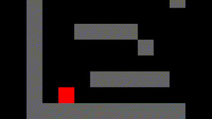

# pygame-junk

Playing with different pygame ideas.

### Overhead 2D Movement with rotation

### Tile based movement

### Basic platform with following camera

### Terrain generation with midpoint displacement

### Projectile based shooting

